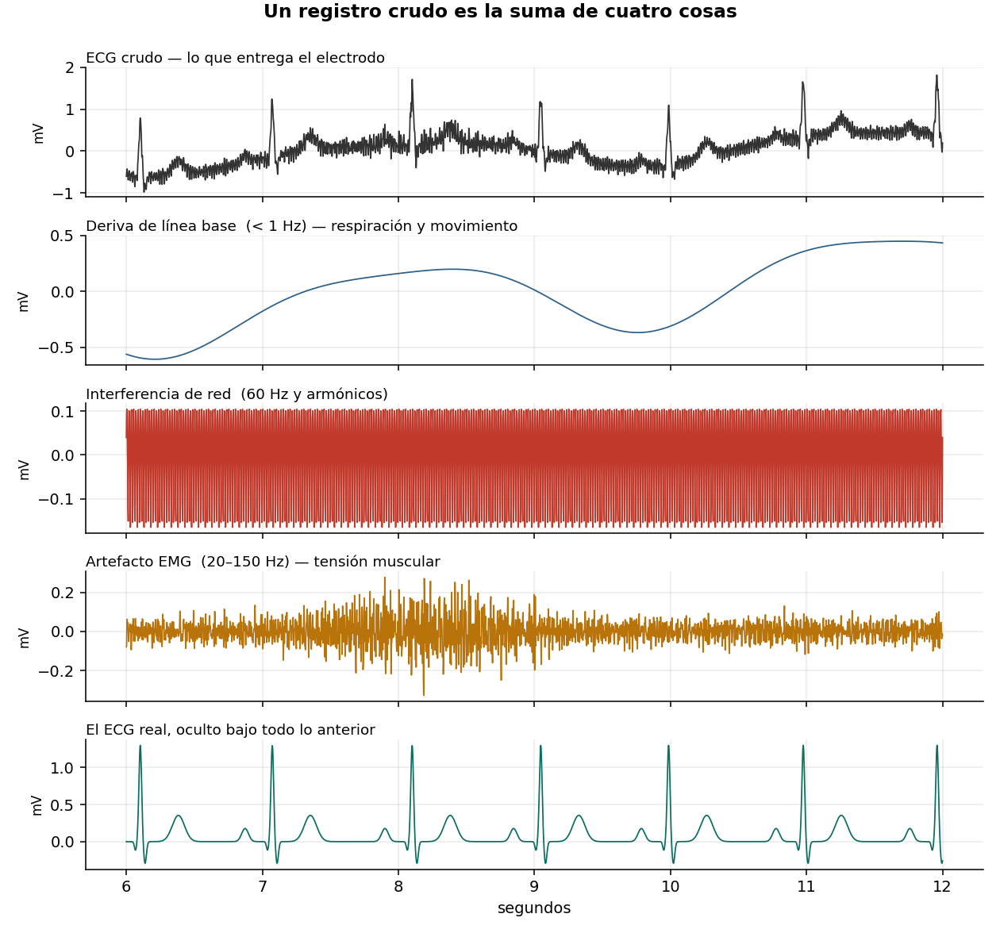
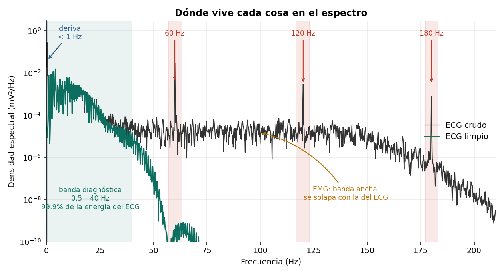
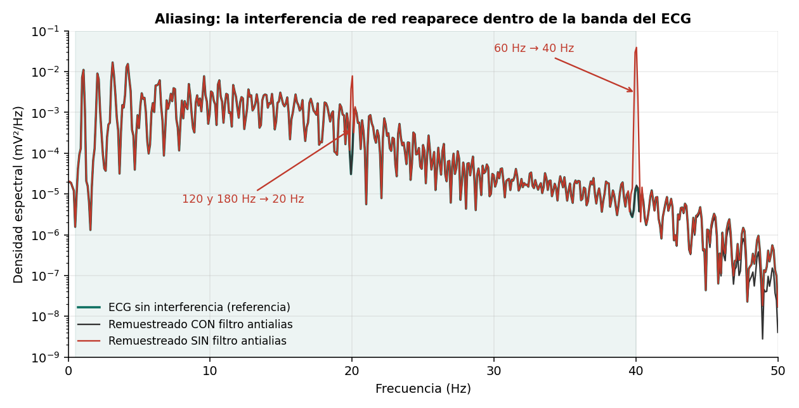

# Por qué un ECG crudo no sirve para nada

Construcción de un registro de ECG contaminado componente por componente, y análisis
espectral de cada fuente de ruido. Incluye una demostración medible de aliasing al
remuestrear sin filtro antialias.



## Resultados

En un registro con niveles de ruido realistas, la relación señal/ruido es **−3.1 dB**:
hay más potencia de ruido que de señal cardiaca. Solo la deriva de línea base tiene un
RMS mayor que el del ECG completo.

| Banda (Hz) | ECG limpio | ECG crudo | Razón |
|---|---|---|---|
| 0 – 0.5 | 0.00001 | 0.06085 | 6744x |
| 1 – 40 | 0.03673 | 0.03711 | 1x |
| 55 – 65 | ~0 | 0.00749 | > 10⁶ |

La banda de 1 a 40 Hz es ECG casi puro; fuera de ella la contaminación es de órdenes de
magnitud. El 99.9% de la energía del ECG está por debajo de 40 Hz.



## Aliasing

Al remuestrear de 500 a 100 Hz sin filtro previo, la interferencia de red reaparece
dentro de la banda diagnóstica: los 60 Hz en 40 Hz, y los armónicos de 120 y 180 Hz en
20 Hz, donde el QRS concentra su energía. Unas 90 veces más potencia que la referencia
en esa banda, de forma irreversible.



```python
mal  = x[::5]                                          # rompe la señal
bien = sg.decimate(x, 5, ftype='fir', zero_phase=True) # correcto
```

## Contenido

```
notebooks/ecg_crudo_fft.ipynb   Notebook completo, ejecutable de principio a fin
src/ecglib.py                   Generador de ECG y modelos de ruido
figuras/                        Figuras generadas
```

## Reproducir

```bash
git clone https://github.com/USUARIO/ecg-crudo-fft.git
cd ecg-crudo-fft
pip install -r requirements.txt
jupyter lab notebooks/ecg_crudo_fft.ipynb
```

No requiere descargar datos: la señal se genera dentro del notebook.

## Notas metodológicas

El generador incluye variabilidad del intervalo RR (SDNN de 34 ms). Un ECG exactamente
periódico produce un peine de armónicos artificial en el espectro que invalidaría el
análisis por bandas.

La frecuencia de muestreo es 500 Hz, la de PTB-XL. A 360 Hz el tercer armónico de la red
(180 Hz) cae justo en Nyquist y no puede representarse.

Para repetir esto con ruido real, el **MIT-BIH Noise Stress Test Database** contiene
grabaciones de deriva, EMG y artefacto de electrodo tomadas de sujetos reales.
**MIT-BIH Arrhythmia** no es adecuada para estudiar ruido de baja frecuencia: trae un
paso-banda de 0.1–100 Hz aplicado en la adquisición.

## Referencias

- McSharry P. et al. *A dynamical model for generating synthetic electrocardiogram signals.* IEEE Trans. Biomed. Eng., 2003.
- Moody G. et al. *A noise stress test for arrhythmia detectors.* Computers in Cardiology, 1984.
- Kligfield P. et al. *Recommendations for the Standardization and Interpretation of the Electrocardiogram, Part I.* Circulation, 2007.

## Licencia

MIT — ver [LICENSE](LICENSE).
